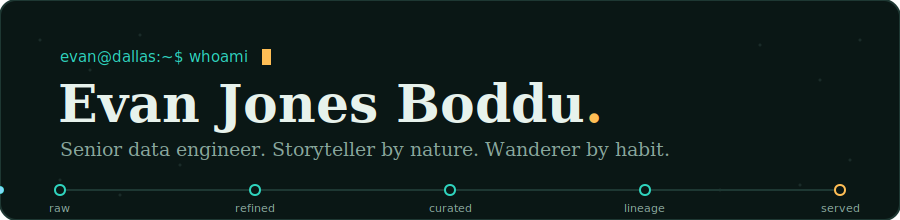
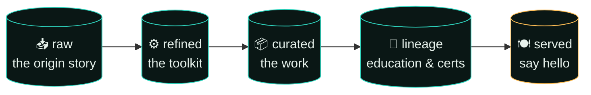
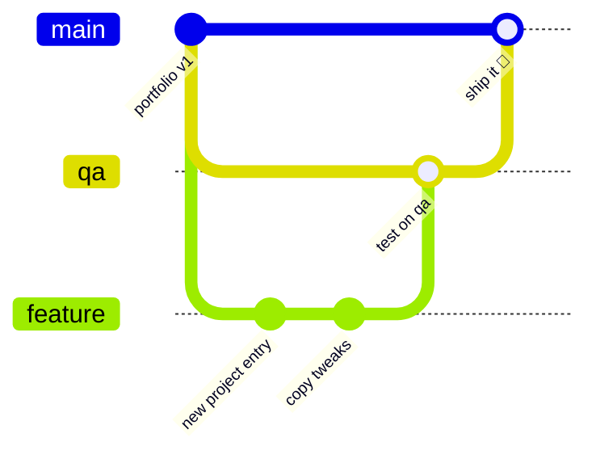

<div align="center">



<br><br>

[](https://evanboddu.github.io)
[](https://www.linkedin.com/in/evanboddu/)
[](mailto:bodduevan@gmail.com)

*Just another human being wandering on the earth. Oh — and I love data,<br>the stories it has to offer, and the challenges that come with it.*

</div>

---

## `SELECT * FROM this_repo;`

This is the source for my personal portfolio — a single-page, zero-dependency site built like the thing I know best: **a data pipeline**. Every section of the site is a data layer, the nav is a pipeline progress bar, and the icons are hand-drawn animated SVGs. No frameworks, no build step, no `node_modules` folder heavier than the site itself. Just one honest HTML file.

```sql
-- how I introduce myself to a new database
SELECT curiosity, craft, coffee
FROM   evan_boddu
WHERE  problem = 'interesting'
ORDER  BY impact DESC;

-- 1 row returned. it's always 1 row. it's just me.
```

## 🗺️ The pipeline (a.k.a. the site map)



## ✨ Things to try on the live site

| Interaction | What happens |
|---|---|
| 🖱️ Move your cursor (or finger) through the hero | The stream of records routes around it, like data avoiding a bad join |
| ▶️ Hit **RUN** on the SQL console | The query executes and returns exactly one row (me) |
| 📈 Watch the ticker | Counts records flowing through my pipelines in real time — 1B+/month ≈ 386/sec |
| 🧭 Scroll | The pipeline in the nav fills stage by stage, icons animate as they enter |
| 🖱️ Hover any card | Gears spin faster, compasses swing, carts hop |

## 🧑‍💻 About the human

<details>
<summary><b>⚙️ The work — Sr. Data Engineer @ Nike</b> <i>(click to expand)</i></summary>
<br>

Since April 2021, I design, build, and support large-scale production ETL/ELT pipelines with **Python, PySpark, Databricks on AWS, Snowflake, Kafka, and Airflow** — processing **1B+ records a month** across enterprise datasets.

Highlights:
- ⚡ Cut batch runtimes **40%** and query times **35%** through Spark & SQL tuning
- 🔄 Halved reporting latency with near real-time Kafka ingestion
- 🧱 Built dimensional models and curated consumption layers teams actually trust
- 🌱 Mentored junior engineers on Spark optimization, SQL tuning, and data modeling

Before that: time-series forecasting of Texas GDP at **ThomasNet** (capstone), and automating CNC machine data workflows at **Bharat Heavy Electricals Limited**.

</details>

<details>
<summary><b>🧰 The toolkit</b> <i>(click to expand)</i></summary>
<br>

| Layer | Tools |
|---|---|
| **Programming & querying** | Python · Advanced SQL / ANSI SQL · PySpark · Spark SQL · Unix/Shell |
| **Big data & streaming** | Apache Spark · Databricks · Kafka · Spark optimization · ETL/ELT |
| **Cloud & platforms** | Databricks on AWS · Snowflake · AWS S3 · Cloud data lakes |
| **Modeling & BI** | Dimensional modeling · Star & snowflake schema · Schema evolution · Tableau |
| **Governance & quality** | Lineage · Access controls · Validation & reconciliation · RCA |
| **Orchestration & reliability** | Airflow · Jenkins · Git & CI/CD · Monitoring · SLA management |

</details>

<details>
<summary><b>🎓 The lineage</b> <i>(click to expand)</i></summary>
<br>

- 🔬 **PhD, Information Technology** (Data Science) — University of the Cumberlands
- 🎓 **MS, Business Analytics** (Data Science Track) — The University of Texas at Dallas
- 🎓 **BE, Electronics & Communications** — Andhra University College of Engineering
- 🏅 Tableau Desktop Specialist · Google Analytics IQ · AWS Fundamentals · SQL for Data Science · HackerRank SQL Gold Badge

</details>

## 🌳 Branch strategy

Just like a good data platform, changes flow through layers before anyone consumes them:



| Branch | Role | Rule |
|---|---|---|
| `main` | 🟢 **Production** — what the live site serves | Only receives merges from `qa` |
| `qa` | 🟡 **Testing** — where changes get verified | Only receives merges from `feature` |
| `feature` | 🔵 **Development** — new entries, experiments, tweaks | All new work starts here |

## 🚀 Run it locally

```bash
git clone <this-repo>
cd <this-repo>
python3 -m http.server 8000
# open http://localhost:8000 — that's it. no npm install. you're welcome.
```

---

<div align="center">
<sub><code>-- no pixels were harmed in the making of this site. a few datasets were gently interrogated.</code></sub>
</div>
